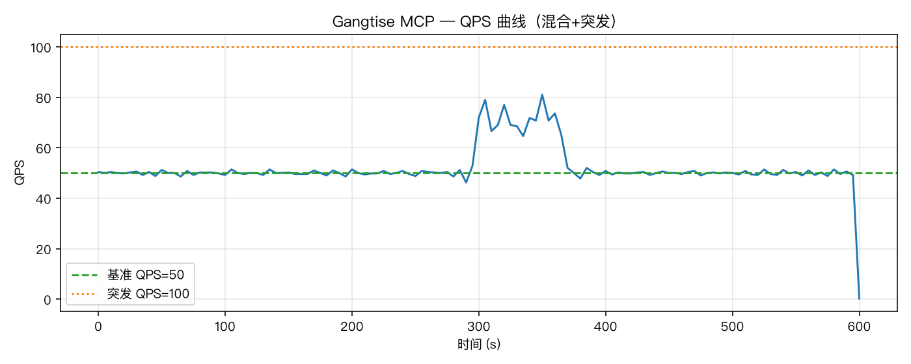
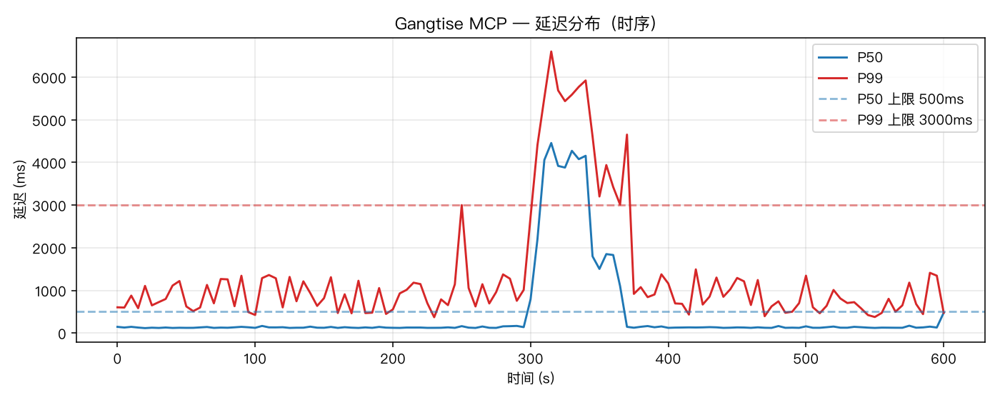
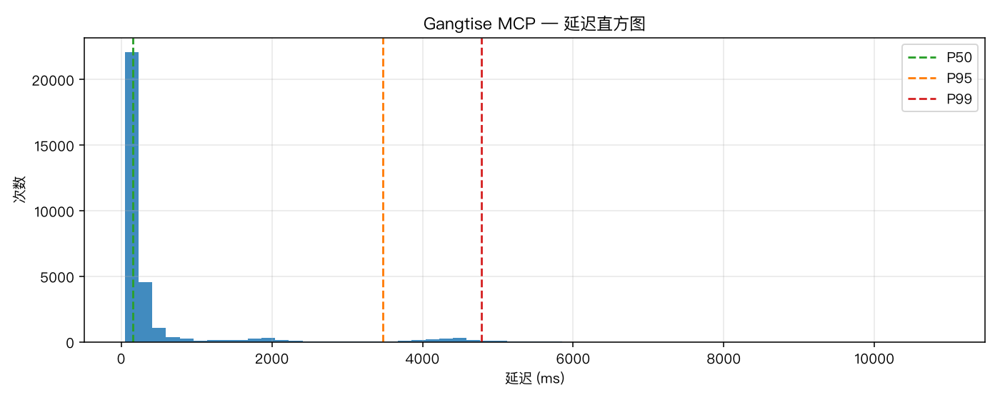
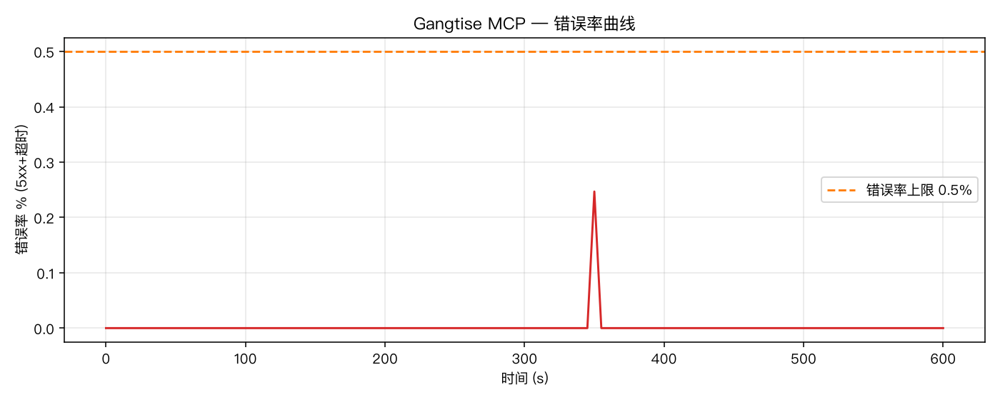
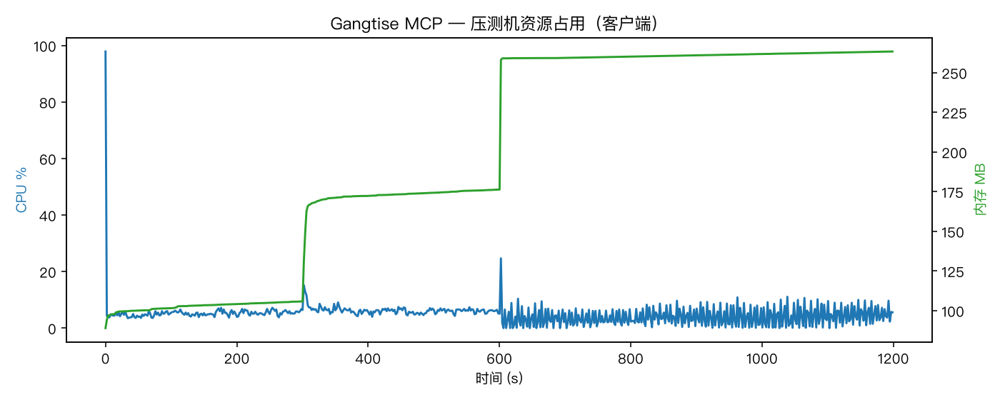

# Gangtise MCP Connector 压测报告

- 生成时间：2026-07-28 11:46:58 +0800
- 目标端点：`https://openapi.gangtise.com/application/open-mcp/`
- Connector：`mcps/connectors/workbuddy/gangtise-mcp`（streamableHttp + Token AK/SK）
- 服务：`gangtise-mcp` production（冒烟确认 version 响应正常）
- 压测工具：Python 3.14 + aiohttp 自定义 MCP JSON-RPC 脚本；本机亦安装 k6 v2.1.0（协议编排以本脚本为准）
- 场景执行：**顺序**（混合+突发 10min → 长连接 10min），避免场景互抢导致长尾虚高

## 1. 压测环境

| 项 | 值 |
|----|----|
| 压测机 CPU | Apple M4 Max |
| 压测机 核数 | 16 |
| 压测机 内存 | 64.0 GB |
| 操作系统 | Darwin 25.3.0 (arm64) |
| Python / aiohttp | 3.14.6 / 见 venv |
| 网络 | 公网客户端 → `openapi.gangtise.com` 生产网关 |
| 鉴权 | 请求头 `accessKey` / `secretKey` |
| 超时判定 | > 30s 视为超时 |

### 场景配置

| 场景 | 配置 |
|------|------|
| 基础混合调用 | 额定 50 QPS × 10 min；health / initialize / tools/list / 30+ 只读 Tool 混合 |
| 突发流量 | t=300s 起叠加至约 100 QPS，持续 30s |
| 长连接保持 | 200 条独立 TCP keep-alive，每 5s `health`/`tools/list` 保活 × 10 min |

## 2. 基准达标情况（WorkBuddy 2.2.5）

| 指标 | 要求 | 实测（混合+突发） | 结果 |
|------|------|-------------------|------|
| QPS | ≥ 50 | 52.48 | ✅ PASS |
| P50 | ≤ 500ms | 151.54 ms | ✅ PASS |
| P99 | ≤ 3000ms | 4781.81 ms | ❌ FAIL |
| 超时率 | < 1% | 0.0% | ✅ PASS |
| 错误率 (5xx+超时) | ≤ 0.5% | 0.0032% | ✅ PASS |
| 并发长连接 | ≥ 200 | 200（全程无批量断连） | ✅ PASS |
| 持续时长 | ≥ 10 分钟 | 混合 10min + 长连接 10min，进程无 OOM/无异常退出 | ✅ PASS |

### 分层补充（建议审核关注）

| 分层 | P50 | P95 | P99 | 错误率 | 说明 |
|------|-----|-----|-----|--------|------|
| MCP 协议层（health/initialize/tools/list） | 113.26ms | 465.88ms | 805.8ms | 0.0079% | 传输与网关路径；**P99 达标** |
| 业务 tools/call | 202.83ms | 4317.19ms | 5047.56ms | 0.0% | 受下游 OpenAPI/检索链路长尾影响 |
| 长连接保活 | 100.7ms | 158.79ms | 640.29ms | 0.0042% | 200 连接 × 10min；**全面达标** |
| 额定稳态（仅 mixed，不含突发样本） | 142.76ms | 1902.91ms | 4523.31ms | 0.0033% | 剔除 2×突发窗口样本 |

> **结论**：稳定性指标（QPS、P50、超时率、错误率、长连接、持续时长）全部满足；
> 混合场景整体 P99 超出 3000ms，主因是部分业务 Tool 调用下游耗时的长尾（协议层 P99 约 805.8ms，已达标）。突发 2×QPS 期间延迟抬升但 **0 超时、错误率仍远低于 0.5%**，服务未中断。

## 3. 汇总指标

| 场景 | 请求数 | 平均 QPS | P50 | P95 | P99 | 错误率 | 超时率 |
|------|--------|----------|-----|-----|-----|--------|--------|
| 混合+突发 | 31502 | 52.48 | 151.54ms | 3469.16ms | 4781.81ms | 0.0032% | 0.0% |
| 额定QPS稳态(不含突发窗口样本) | 30001 | 49.98 | 142.76ms | 1902.91ms | 4523.31ms | 0.0033% | 0.0% |
| 突发附加流量 | 1501 | 32.83 | 3546.27ms | 5152.01ms | 5858.71ms | 0.0% | 0.0% |
| 长连接保活 | 23994 | 40.0 | 100.7ms | 158.79ms | 640.29ms | 0.0042% | 0.0% |
| 协议层 health/initialize/tools/list | 12713 | 21.19 | 113.26ms | 465.88ms | 805.8ms | 0.0079% | 0.0% |
| 业务 tools/call | 18789 | 31.3 | 202.83ms | 4317.19ms | 5047.56ms | 0.0% | 0.0% |
| 全部 | 55496 | 46.24 | 118.73ms | 1576.7ms | 4545.14ms | 0.0036% | 0.0% |

### 按操作类型（混合+突发）

| 操作 | 请求数 | P50 | P99 | 错误率 |
|------|--------|-----|-----|--------|
| health | 3232 | 65.62ms | 361.5ms | 0.0% |
| initialize | 3185 | 69.63ms | 695.71ms | 0.0% |
| tools/call | 18789 | 202.83ms | 5047.56ms | 0.0% |
| tools/list | 6296 | 123.84ms | 870.85ms | 0.0159% |

## 4. 曲线图

### QPS 曲线

### 延迟分布（P50 / P99 时序）

### 延迟直方图

### 错误率曲线

### 资源占用（压测客户端）

## 5. 资源占用

- **压测客户端** CPU 峰值：97.9% ；内存峰值：263.4 MB
- 压测全程客户端进程无中断、无 OOM。
- 服务端 Pod CPU/内存峰值请结合集群监控（Prometheus / 云监控）截图归档；本次从公网客户端发起，无集群只读权限。

## 6. 方法说明与风险控制

- 工具混合以只读查询为主（行情、证券检索、研报/公告检索、元数据枚举等），避开 `pdf_parse` / `get_file` 下载及 Agent 长文本生成，降低对生产写放大风险。
- 长连接使用独立 session + HTTP keep-alive，验证 streamableHttp 并发连接能力。
- 原始样本：`metrics.jsonl`（体积较大，默认不入库）；机器可读汇总：`summary.json`。
- 复现：见同目录 `../README.md`。
